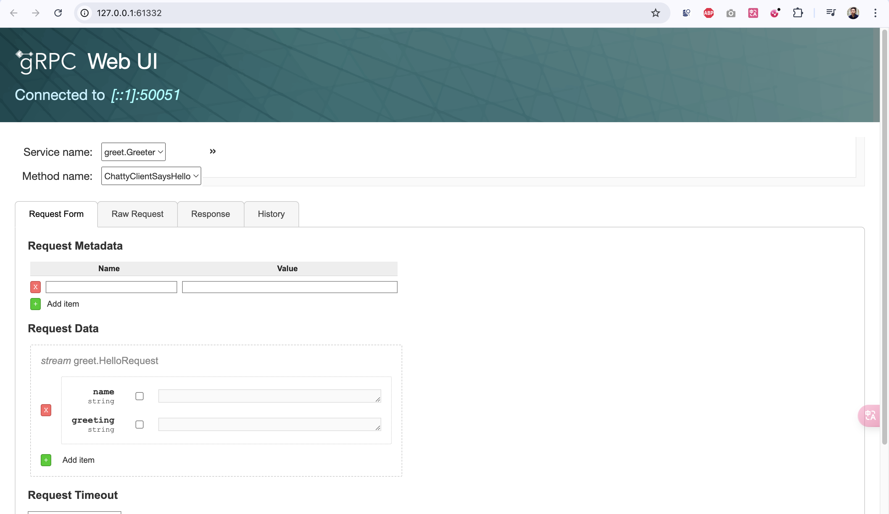

# Python gRPC

## Preparation
Use a virtual environment:
```
python3 -m venv path/to/venv
source path/to/venv/bin/activate
python3 -m pip install xyz
```

## Install grpcio-tools
```
pip3 install grpcio-tools
```

## Generate proto
```
python3 -m grpc_tools.protoc -I protos --python_out=. --grpc_python_out=. protos/greeter.proto
```

## Run project
```
python3 greet_server.py
```

## Reflection
```
pip3 install grpcio-reflection
```
Set reflection : https://github.com/grpc/grpc/blob/master/doc/python/server_reflection.md

